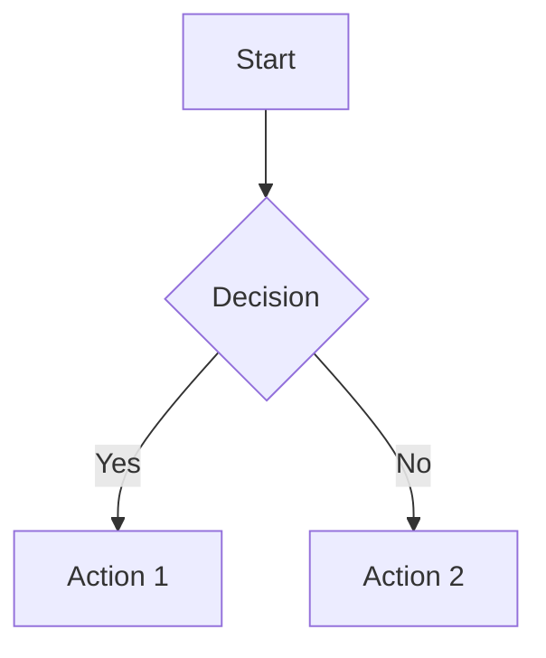
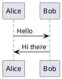
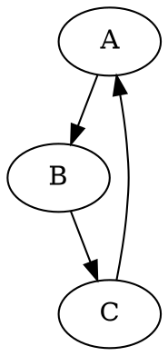

<div align="center">

# Markdown Notes Documentation

[](https://git.io/typing-svg)


</div>

> **Last Updated**: February 17, 2026

## Table of Contents
1. [Quick Start](#quick-start)
2. [Features Overview](#features-overview)
3. [AI Assistant Guide](#ai-assistant-guide)
4. [Diagram & Chart Support](#diagram--chart-support)
5. [Cloudflare KV Setup](#cloudflare-kv-setup)
6. [Keyboard Shortcuts](#keyboard-shortcuts)
7. [Troubleshooting](#troubleshooting)

---

## Quick Start

### Installation
1. Clone the repository
2. Open `public/index.html` in a browser
3. Start creating markdown notes!

### Basic Usage
- **New Note**: Click "New Note" button or press `Ctrl+N`
- **Save Note**: Press `Ctrl+S`
- **Share**: Click "Share" to generate a public link
- **Preview**: Toggle preview with `Ctrl+P`

---

## Features Overview

### Core Features
 **Real-time Preview** - See changes as you type  
 **Local Storage** - Notes saved automatically  
 **Share Links** - Generate public URLs for notes  
 **Dark Theme** - Easy on the eyes  
 **Markdown Support** - Full GFM syntax  
 **Math Equations** - KaTeX rendering  
 **Syntax Highlighting** - Code blocks with Highlight.js & Prism  

### Advanced Features
 **AI Assistant** - OpenAI, Gemini, OpenRouter support  
 **Diagrams** - Mermaid, PlantUML, Graphviz, D2  
 **Charts** - Chart.js, Plotly, Vega, Vega-Lite  
 **Agent Mode** - Auto-create/edit files with AI  
 **Multiple API Keys** - Store and switch between providers  
 **Dynamic Models** - Auto-fetch model lists  
 **Code Runner** - Execute runnable code fences via Piston (default) or Judge0 self-host  

---

## AI Assistant Guide

### Setup

1. **Open AI Settings**
   - Click the AI button () in the bottom-right
   - Or press `Ctrl+I`
   - Click " Settings"

2. **Configure API Keys**
   - Add keys for one or more providers:
     - **OpenAI**: Get from https://platform.openai.com/api-keys
     - **Gemini**: Get from https://makersuite.google.com/app/apikey
     - **OpenRouter**: Get from https://openrouter.ai/keys

3. **Select Provider & Model**
   - Choose your preferred provider
   - Select a model (or let it auto-fetch)

### Using AI Features

#### Quick Actions
- **Improve** - Enhance text quality
- **Fix Grammar** - Correct errors
- **Expand** - Add more details
- **Summarize** - Make concise
- **Explain** - Simplify concepts

#### Agent Mode (Auto-Create/Edit)
1. Enable **Agent Mode** in settings
2. Type a prompt like:
   - "Create a tutorial about Python loops"
   - "Write a blog post about AI"
   - "Generate a todo list for project setup"
3. AI will automatically create/edit the note in the editor

#### Custom Prompts
Type any request:
```
Create a mermaid flowchart for user authentication
Explain quantum computing in simple terms
Generate a comparison table of Python vs JavaScript
```

### Code Runner (Piston + Judge0 Self-Host)

1. Open **AI Settings**
2. Enable **Code Runner**
3. No API key needed for default Piston mode
4. Add code fences in supported languages (`javascript`, `python`, `java`, `c`, `cpp`, `go`, `rust`, `csharp`, `bash`)
5. Optional: set `JUDGE0_SELF_HOST_URL` in Worker env to use Judge0 self-host
6. Click **Run** button in preview above the code block

### Templates
Quick prompts for common tasks:
- Create a tutorial
- Generate a diagram
- Write a blog post
- Explain code
- Create a list
- Compare topics

### Keyboard Shortcuts
- `Ctrl+I` - Toggle AI panel
- `Ctrl+Enter` - Send prompt (when in AI input)

---

## Diagram & Chart Support

### Mermaid Diagrams

````markdown

````

### PlantUML

````markdown

````

### Graphviz

````markdown

````

### D2 Diagrams

````markdown
```d2
server -> database: query
database -> server: result
```
````

### Chart.js

````markdown
```chartjs
{
  "type": "bar",
  "data": {
    "labels": ["Red", "Blue", "Yellow"],
    "datasets": [{
      "label": "Votes",
      "data": [12, 19, 3]
    }]
  }
}
```
````

### Plotly

````markdown
```plotly
{
  "data": [{
    "x": [1, 2, 3, 4],
    "y": [10, 15, 13, 17],
    "type": "scatter"
  }]
}
```
````

### Vega-Lite

````markdown
```vega-lite
{
  "data": {"values": [
    {"a": "A", "b": 28},
    {"a": "B", "b": 55}
  ]},
  "mark": "bar",
  "encoding": {
    "x": {"field": "a", "type": "ordinal"},
    "y": {"field": "b", "type": "quantitative"}
  }
}
```
````

---

## Cloudflare KV Setup

### Prerequisites
- Cloudflare account
- Wrangler CLI installed

### Steps

1. **Install Wrangler**
```bash
npm install -g wrangler
```

2. **Login to Cloudflare**
```bash
wrangler login
```

3. **Create KV Namespace**
```bash
wrangler kv:namespace create "SHARED_NOTES"
```

4. **Update wrangler.toml**
```toml
kv_namespaces = [
  { binding = "SHARED_NOTES", id = "your-namespace-id" }
]
```

5. **Set Worker Environment Variables**
   - `MASTER_KEY` (already used for share-management routes)
   - `JUDGE0_SELF_HOST_URL` (optional; if unset, Piston is used by default)

6. **Deploy**
```bash
wrangler deploy
```

---

## Keyboard Shortcuts

### Editor
- `Ctrl+N` - New note
- `Ctrl+S` - Save note
- `Ctrl+P` - Toggle preview
- `Ctrl+B` - Bold text
- `Ctrl+I` - Italic text (or toggle AI if AI is focused)

### AI Assistant
- `Ctrl+I` - Toggle AI panel
- `Ctrl+Enter` - Send prompt
- `Esc` - Close AI panel

### Navigation
- `Ctrl+K` - Search notes
- `↑/↓` - Navigate note list

---

## Troubleshooting

### Diagrams Not Rendering
1. Check browser console for errors
2. Verify code block syntax (must use triple backticks)
3. Ensure correct diagram type is specified

### AI Not Working
1. Check API key is set correctly
2. Verify internet connection
3. Check browser console for API errors
4. Ensure you have API credits/quota

### Scrolling Issues
- Fixed with custom scrollbar styling
- Works on all major browsers

### Share Links Not Working
1. Verify Cloudflare KV is set up
2. Check wrangler.toml configuration
3. Ensure worker is deployed

### Notes Not Saving
- Check browser localStorage is enabled
- Clear browser cache if needed
- Check for localStorage quota errors

---

## Advanced Configuration

### Custom API Endpoints
Edit in AI settings to use custom endpoints for:
- OpenAI-compatible APIs
- Self-hosted models
- Local LLM servers

### Model Selection
- **OpenAI**: gpt-4, gpt-3.5-turbo, gpt-4-turbo
- **Gemini**: gemini-pro, gemini-pro-vision
- **OpenRouter**: Multiple models from various providers

### Agent Mode Settings
- **Auto-save**: Automatically save AI-generated content
- **Insert mode**: Replace selection or insert at cursor
- **Confirmation**: Prompt before applying changes

---

## Contributing

Found a bug? Want to add a feature?

1. Fork the repository
2. Create a feature branch
3. Make your changes
4. Submit a pull request

---

## License

MIT License - Feel free to use and modify!

---

## Support

- Email: toontamilind@gmail.com
- Issues: GitHub Issues
- Discussions: GitHub Discussions

---

*Made with  by ToonTamilIndia*
