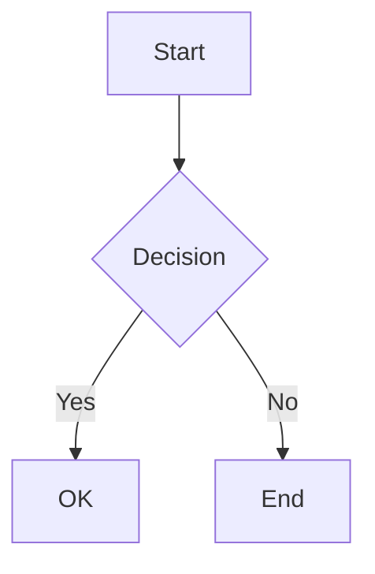
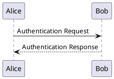
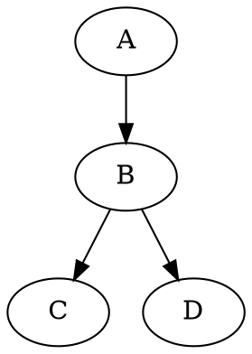

---

### ⚠️ **Disclaimer**

*This repository contains vibe-coded scripts intended for personal use. 
Contributions are welcome, but breakages are expected 
and if something breaks, it’s a feature, not a bug.*

---

# 📝 Markdown Notes - ToonTamilIndia

A beautiful, feature-rich Markdown notes application with comprehensive diagram support, math rendering, charts, and advanced visualization capabilities.

## 🌐 Live Site

**URL:** [markdown.toontamilindia.in](https://markdown.toontamilindia.in)

## ✨ Features

### Core Features
- **📝 Markdown Editor** - Full Markdown support with live preview
- **🔢 Math Equations** - LaTeX math rendering via KaTeX (ChatGPT compatible)
- **💾 Auto-Save** - Notes are automatically saved to local storage
- **🔍 Search** - Quick search across all notes
- **📱 Responsive** - Mobile-friendly with improved sidebar menu

### 📊 Diagrams & Visualizations

#### Diagram Support
- **Mermaid** - Flowcharts, sequence diagrams, Gantt charts, state diagrams, etc.
- **PlantUML** - UML diagrams (class, sequence, activity, component, etc.)
- **Graphviz (DOT)** - WASM-based rendering for graph visualizations
- **D2** - Modern declarative diagram language

#### Chart Support
- **Chart.js** - Bar, line, pie, doughnut, radar charts
- **Plotly** - Interactive scientific plots and 3D visualizations
- **Vega-Lite** - Grammar of graphics for data visualization
- **Vega** - Full declarative visualization grammar

### 🎨 Syntax Highlighting
- **Highlight.js** - 190+ languages (default)
- **Prism** - Lightweight alternative with line highlighting
- **Shiki** - VSCode-quality static highlighting

### Advanced Features
- **🔑 Master Key** - Secure master key for managing all notes
- **🏷️ Custom Aliases** - Create custom URL aliases for easy sharing
- **📋 Quick Paste** - Paste ChatGPT conversations directly
- **📤 Export** - Export notes as Markdown, HTML, PDF, JSON
- **🔗 Share** - Generate compressed shareable links with QR codes
- **📱 Mobile Optimized** - Touch-friendly interface with auto-closing sidebar
- **⌨️ Keyboard Shortcuts** - Efficient editing with shortcuts
- **💡 Callouts** - Info, warning, success, and danger callouts
- **✅ Task Lists** - Interactive checkboxes
- **📁 Collapsible Sections** - Hide/show content sections
- **🤖 AI Assistant** - AI-powered content creation and editing (Desktop only)
- **▶️ Code Runner** - Run supported code blocks (Piston default, Judge0 self-host optional)

## 🚀 New in This Update

### Diagram Rendering
- ✅ **Mermaid diagrams now render in both editor preview AND shared links**
- ✅ WASM-based Graphviz rendering (client-side, no server needed)
- ✅ PlantUML integration with server-side rendering
- ✅ D2 diagram support with playground integration

### Chart Support
- ✅ Chart.js for common chart types
- ✅ Plotly for scientific visualizations
- ✅ Vega and Vega-Lite for advanced data visualization

### Mobile Improvements
- ✅ Fixed sidebar toggle on mobile devices
- ✅ Auto-close sidebar when clicking outside
- ✅ Better touch targets and responsive design
- ✅ Improved toolbar layout for small screens

### Framework Support
- ✅ Unified/Remark/Rehype compatible (via Marked.js)
- ✅ Markdown-it ready
- ✅ MDX support (can be integrated)
- ✅ Excalidraw integration available

### AI Assistant (NEW!)
- ✅ **Multi-provider support** - OpenAI, Google Gemini, OpenRouter
- ✅ **Content generation** - Create notes from descriptions
- ✅ **Text improvement** - Enhance, fix grammar, expand, summarize
- ✅ **Diagram generation** - Create Mermaid, PlantUML, Graphviz diagrams
- ✅ **Q&A mode** - Ask questions about your notes
- ✅ **Inline editing** - Ctrl+I for quick AI access (like VS Code)
- ✅ **Desktop only** - Optimized UX for desktop users
- ✅ **Secure** - API keys stored locally in browser
- ✅ **Hosted code execution** - Piston by default, auto-switch to Judge0 self-host when configured

## 🔧 Usage

### Creating Notes
1. Click **"+ New Note"** in the sidebar
2. Write your Markdown content in the editor
3. Notes auto-save as you type

### Math Equations
- **Inline math:** `$E = mc^2$` renders as inline equation
- **Block math:** 
  ```
  $$
  \int_{0}^{\infty} e^{-x^2} dx = \frac{\sqrt{\pi}}{2}
  $$
  ```

### Creating Diagrams

#### Mermaid Flowchart
````markdown

````

#### PlantUML Sequence Diagram
````markdown

````

#### Graphviz Graph
````markdown

````

#### D2 Diagram
````markdown
```d2
x -> y -> z
users -> database: query
```
````

### Creating Charts

#### Chart.js
````markdown
```chartjs
{
  "type": "bar",
  "data": {
    "labels": ["Jan", "Feb", "Mar"],
    "datasets": [{
      "label": "Sales",
      "data": [12, 19, 3]
    }]
  }
}
```
````

#### Plotly
````markdown
```plotly
{
  "data": [{
    "x": [1, 2, 3],
    "y": [2, 4, 6],
    "type": "scatter"
  }]
}
```
````

#### Vega-Lite
````markdown
```vega-lite
{
  "$schema": "https://vega.github.io/schema/vega-lite/v5.json",
  "data": {"values": [{"a": "A", "b": 28}]},
  "mark": "bar",
  "encoding": {
    "x": {"field": "a", "type": "nominal"},
    "y": {"field": "b", "type": "quantitative"}
  }
}
```
````

### Custom Aliases
1. Enter an alias in the "Custom alias" field
2. Access your note via `markdown.toontamilindia.in/#your-alias`

### AI Assistant (Desktop Only)

The AI assistant helps you create, edit, and enhance content using multiple AI providers.

#### Setup
1. Click the AI button (bottom-right) or press **Ctrl+I**
2. Go to **Configure AI** in the settings
3. Choose provider: OpenAI, Google Gemini, or OpenRouter
4. Enter your API key
5. Select your preferred model

#### Quick Actions
- **✨ Improve** - Enhance selected text
- **✓ Fix Grammar** - Correct grammar and spelling
- **📝 Expand** - Add more details
- **📄 Summarize** - Make content concise
- **💡 Explain** - Get simple explanations

#### Custom Prompts
```
Create a tutorial about Python
Generate a mermaid flowchart for login process
Explain this code
Continue writing from here
```

See [AI_GUIDE.md](./AI_GUIDE.md) for comprehensive documentation.

### Code Runner (Piston default + Judge0 self-host optional)

1. Open **AI Settings**
2. In **Code Runner**, enable run buttons for code blocks
3. Optional: set Worker env `JUDGE0_SELF_HOST_URL` to use your own Judge0 server
4. If `JUDGE0_SELF_HOST_URL` is not set, Worker uses `https://emkc.org/api/v2/piston/execute`
5. Add fenced code blocks (for example `python` or `javascript`) and click **Run** in preview

### Master Key Access
- Click **"🔑 Master Key"** in the sidebar
- Enter your configured master key
- This grants full editing access to all notes

### Keyboard Shortcuts
| Shortcut | Action |
|----------|--------|
| `Ctrl/Cmd + S` | Save note |
| `Ctrl/Cmd + N` | New note |
| `Ctrl/Cmd + B` | Bold |
| `Ctrl/Cmd + I` | AI Assistant (Desktop only) |
| `Ctrl/Cmd + K` | Insert link |
| `Escape` | Close modals |

## 🚀 Deployment

### Option 1: Static Hosting (Recommended)

#### Netlify
1. Push to GitHub
2. Connect repo to Netlify
3. Set custom domain: `markdown.toontamilindia.in`

#### Vercel
1. Push to GitHub
2. Import project in Vercel
3. Set custom domain

#### GitHub Pages
1. Push to GitHub
2. Enable Pages in repo settings
3. Configure custom domain

### Option 2: Self-Hosting
Simply serve these files from any web server:
- `index.html`
- `styles.css`
- `app.js`
- `sw.js`
- `manifest.json`

### DNS Configuration
Add these DNS records for `markdown.toontamilindia.in`:
```
Type: CNAME
Name: markdown
Value: your-deployment-url
```

## 📁 File Structure

```
Markdown/
├── index.html      # Main HTML file
├── styles.css      # Styles
├── app.js          # Application logic
├── sw.js           # Service Worker (PWA)
├── manifest.json   # PWA manifest
└── README.md       # This file
```

## 🔒 Security Note

The master key provides access to manage all notes stored in the KV storage. For Cloudflare Workers/Pages deployments, configure the `MASTER_KEY` environment variable securely in your Cloudflare dashboard. This is a client-side application - all personal notes are stored locally in the user's browser.

## 📄 License

Created for ToonTamilIndia. Free to use and modify.

---

Made with ❤️ for easy note-taking
